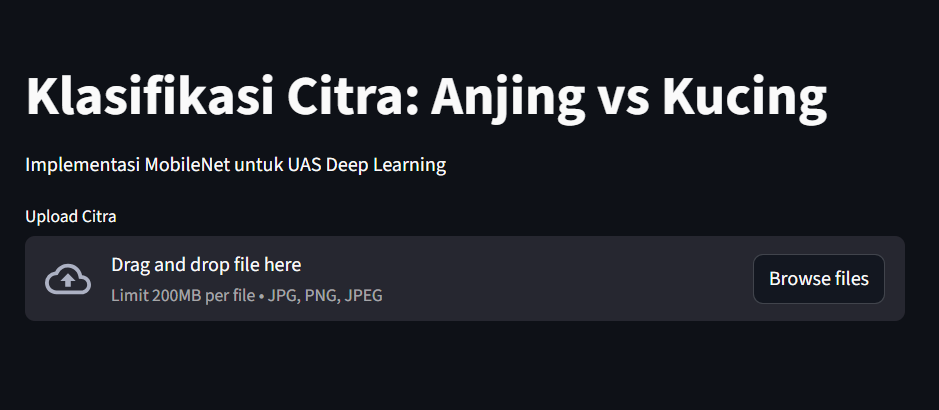
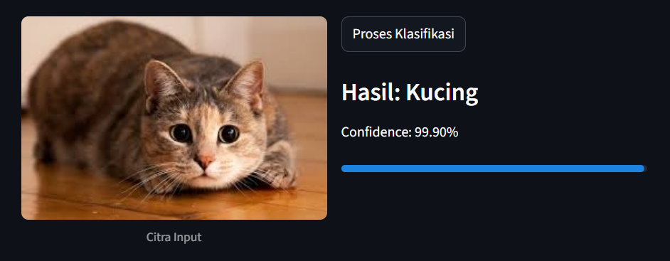

# Klasifikasi Citra: Anjing vs Kucing (MobileNetV2)

Repository ini berisi implementasi model Deep Learning menggunakan arsitektur **MobileNetV2** (Transfer Learning) untuk membedakan gambar anjing dan kucing.

Proyek ini dibuat untuk memenuhi tugas mata kuliah Deep Learning. Selain script latihan model (Jupyter Notebook), repo ini sekarang dilengkapi aplikasi web sederhana menggunakan **Streamlit** agar bisa dicoba langsung untuk prediksi gambar.

## Fitur
- Klasifikasi citra binary (Anjing atau Kucing)
- Menampilkan skor confidence (seberapa yakin modelnya)
- Interface web sederhana (tinggal upload foto)

## Dataset
Dataset yang digunakan berasal dari Kaggle: [Link Dataset](https://www.kaggle.com/datasets/citranurjanah/kucing-dan-anjing-uas-ai).
Model dilatih menggunakan data yang dibagi menjadi folder `train` dan `test`.

## Preview Aplikasi





## Cara Menjalankan Web App
Pastikan Python sudah terinstall di laptop.

1. **Install Library**
   Install library pendukung (PyTorch, Streamlit, dll) lewat terminal:
   ```bash
   pip install streamlit torch torchvision pillow numpy
   ```

2. **Jalankan Aplikasi**
   Pastikan file model `model_anjingkucing_mobilenet.pt` sudah ada dalam satu folder, lalu jalankan:
   ```bash
   streamlit run app.py
   ```

3. **Gunakan**
   Website akan terbuka otomatis di browser. Cukup upload gambar format JPG/PNG untuk melihat hasil prediksinya.

## Performa Model
Model dilatih di Google Colab menggunakan GPU T4.
- **Akurasi Test**: 96.15%
- **Arsitektur**: MobileNetV2 (Pretrained ImageNet)
- **Metode**: Fine-tuning classifier head

---
**Identitas Mahasiswa**
* **Nama:** Moch. Arif Samsul Rizal
* **NIM:** 202211420083
